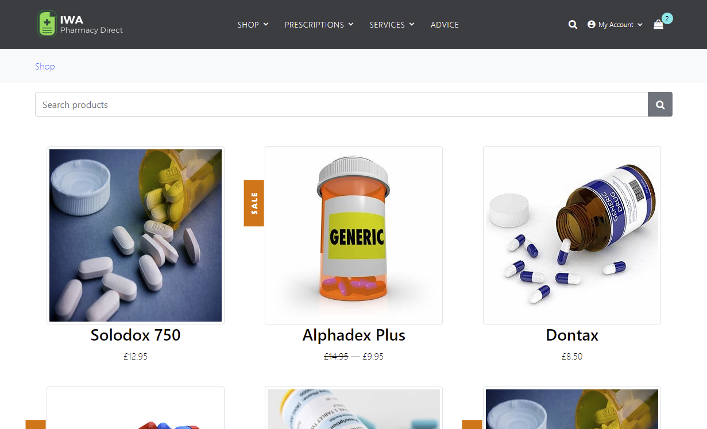

[](https://dev.azure.com/opentext-appsec/IWA-DotNet/_build/latest?definitionId=2&branchName=master)

# IWA.NET Pharmacy Direct

#### Table of Contents

*   [Overview](#overview)
*   [Forking the Repository](#forking-the-repository)
*   [Pre-Requisites](#pre-requisites)
*   [Building the Application](#building-the-application)
*   [Running the Application](#running-the-application)
*   [Application Security Testing Integrations](#application-security-testing-integrations)
    * [SAST using OpenText Static Application Security Testing Command Line](#sast-using-opentext-static-application-security-testing-command-line)
    * [SAST using OpenText ScanCentral SAST](#sast-using-opentext-scancentral-sast)
    * [SAST using OpenText Core Application Security](#sast-using-opentext-core-application-security)
    * [DAST using OpenText DAST](#dast-using-opentext-dast)
    * [DAST using OpenText ScanCentral DAST](#dast-using-opentext-scancentral-dast)
    * [DAST using OpenText Core Application Security](#dast-using-opentext-core-application-security)
    * [API Security Testing using OpenText DAST and Postman](#api-security-testing-using-opentext-dast-and-postman)
    * [API Security Testing using OpenText ScanCentral DAST](#api-security-testing-using-opentext-scancentral-dast)
    * [Open Source Software Composition Analysis using OpenText Core SCA](#open-source-software-composition-analysis-using-opentext-core-sca)
*   [Build and Pipeline Integrations](#build-and-pipeline-integrations)
    * [Azure DevOps Pipeline](#azure-devops-pipelines)
*   [Developing and Contributing](#developing-and-contributing)
*   [Licensing](#licensing)

## Overview

_IWA.NET Pharmacy Direct_ is an insecure Microsoft.NET Web Application for use in **DevSecOps** scenarios and demonstrations.
It includes some examples of bad and insecure code - which can be found using static and dynamic application
security testing tools such as [OpenText Application Security](https://www.opentext.com/en-gb/products/application-security).
 
This project targets .NET 9 (`net9.0`).
The application is intended to provide the functionality of a typical "online pharmacy", including purchasing Products (medication)
and requesting Services (prescriptions, health checks etc). It has a modern-ish HTML front end (with some JavaScript) and a Swagger based API.

*Please note: the application should not be used in a production environment!*



## Forking the Repository

In order to execute example scenarios for yourself it is recommended that you "fork" a copy of this repository into
your own GitHub account. The process of "forking" is described in detail in the 
[GitHub documentation](https://docs.github.com/en/github/getting-started-with-github/fork-a-repo) - you can start the process 
by clicking on the "Fork" button at the top right.

## Pre-Requisites

 - [Microsoft.NET 9.0 SDK](https://dotnet.microsoft.com/en-US/download/dotnet/9.0)
 - Visual Studio 2022 (update to the latest release) with the **ASP.NET and web development** workload — recommended for the full debugging and tooling experience.
 - Visual Studio Code with the **C#** (OmniSharp) extension and the `.NET` workload installed — lightweight alternative that works with the `dotnet` CLI.

Ensure your IDE is updated to support .NET 9 (install recent updates or extensions as needed).

 - (Optional) SQL Server Express 2019 including SQL Server LocalDB
 - (Optional) [OpenText Static Application Security Testing](https://www.opentext.com/en-gb/products/static-application-security-testing) local install
 - (Optional) [Fortify command line (fcli) tool](https://github.com/fortify/fcli)
 - (Optional) [OpenText Core SCA CLI](https://github.com/debricked/cli)

## Building the Application

To build the application, select `Build->Build Solution` from within Visual Studio or
carry out the following from a command prompt:

```Cmd
cd InsecureWebApp
dotnet restore
dotnet build
```

To create a Docker image build the application as above and then carry out the following:

```Cmd
cd InsecureWebApp
docker build --tag iwa.net --file Dockerfile .
```

## Running the Application

To run the application, click on the "Run/Play" button in Visual Studio (with the `IWA` profile selected) or carry out the following from a command prompt:

```Cmd
cd InsecureWebApp
dotnet run
```

To run a Docker container using the image built above you can use:

```Cmd
cd InsecureWebApp
docker run -d -p 5001:80 iwa.net
```

Whichever mechanism you use, the application should be available in your browser at `https://localhost:5001/`
You can login as either of the following users: `user@localhost.com/password` or `admin@localhost.com/password`.

## Application Security Testing Integrations

### SAST using OpenText Static Application Security Testing Command Line

There is an example powershell script in the top level directory that you can use to execute static application security testing
via [OpenText Static Application Security Testing](https://www.opentext.com/en-gb/products/static-application-security-testing).

```Cmd
./scan.ps1
```

This script runs a "sourceanalyzer" translation and scan on the project's source code. 
It creates a Fortify Project Results file called `IWA-DotNet.fpr` which you can open using the Fortify `auditworkbench` tool:

```Cmd
auditworkbench IWA-DotNet.fpr
```

### SAST using OpenText ScanCentral SAST

To execute an [OpenText ScanCentral SAST](https://www.opentext.com/en-gb/products/saas/scancentral-sast) scan you need to package and 
upload the source code to the OpenText ScanCentral SAST service

```Cmd
cd InsecureWebApp
scancentral -url _SCANCENTRAL_CTRL_URL_ start -upload -uptoken _CI_TOKEN_ --build-tool msbuild --build-file IWA.NET.sln -sp fortifypackage.zip `
    -application __YOUR_APP_ -version _YOUR_APP_VERSION_ -email _YOUR_EMAIL_ -block -o -f IWA-DotNet.fpr
```

where `_SCANCENTRAL_CTRL_URL_` and `_CI_TOKEN_` are the ScanCentral SAST Controller URL and the value of a CIToken you have created in the OpenText 
Core Application Security UI, and `_YOUR_APP_` and `_YOUR_APP_VERSION_` is the Application and Version name you are running the scan for.

### SAST using OpenText Core Application Security

To execute an [OpenText Core Application Security](https://www.opentext.com/en-gb/products/saas/core-application-security) 
SAST scan you need to package and upload the source code. 
To package the code into a Zip file for uploading you can use the `scancentral` command utility as following:

```Cmd
cd InsecureWebApp
scancentral package -bt dotnet -bf .\InsecureWebApp.csproj
```

You can then upload this manually using the OpenText Core Application Security UI or alternately you can use the 
[fcli](https://github.com/fortify/fcli) tool to upload this Zip file and start a scan using the following:

```Cmd
fcli fod session login --url https://api.ams.fortify.com --client-id __FOD_CLIENT_ID_ --client-secret _FOD_CLIENT_SECRET__
fcli fod sast-scan start --release _YOUR_APP_:_YOUR_REL_ -f fortifypackage.zip --store curScan
fcli fod sast-scan wait-for ::curScan::
``` 

where `_FOD_CLIENT_ID_` and `_FOD_CLIENT_SECRET_` are the values of an API Key and Secret you have created in the OpenText 
Core Application Security UI, and `_YOUR_APP_` and `_YOUR_REL_` is the Application and Release name you are running the scan for.

### DAST using OpenText DAST

To carry out an OpenText DAST (WebInspect) scan you should first "run" the application using one of the steps described above.
Then you can start a scan using the following command line:

```
"C:\Program Files\Fortify\Fortify WebInspect\WI.exe" -s ".\etc\IWA-UI-Dev-Settings.xml" -macro ".\etc\IWA-UI-Dev-Login.webmacro" -u "https://localhost:5001" -ep ".\IWA-DotNet-DAST.fpr" -ps 1008
```

This will start a scan using the Default Settings and Login Macro files provided in the `etc` directory. It assumes
the application is running on "https://localhost:5001". It will run a "Critical and High Priority" scan using the policy with id 1008. 
Once completed you can open the OpenText DAST "Desktop Client" and navigate to the scan created for this execution. An FPR file
called `IWA-DotNet-DAST.fpr` will also be available - you can open it with `auditworkbench` (or generate a
PDF report from using `ReportGenerator`). You could also upload it to the OpenText Application Security UI.

### DAST using OpenText ScanCentral DAST

TBD

### DAST using OpenText Core Application Security

TBD

### API Security Testing using OpenText DAST and Postman

TBD

### API Security Testing using OpenText ScanCentral DAST

TBD

### Open Source Software Composition Analysis using OpenText Core SCA

To carry out an OpenText Core SCA scan using the [CLI](https://github.com/debricked/cli) carry out the following from a command prompt:

```Cmd
cd InsecureWebApp
debricked scan . -e "*\**.lock" -e "**\node_modules\**" -r _DEBRICKED_REPO_ -t _DEBRICKED_TOKEN_ --generate-commit-name
```

where `_DEBRICKED_REPO_` is the name of the repository you want represented in OpenText Core SCA UI and 
`_DEBRICKED_TOKEN_` is your OpenText Core SCA [access token](https://docs.debricked.com/product/administration/generate-access-token).

## Build and Pipeline Integrations

### Azure DevOps Pipeline

An Azure DevOps pipeline [azure-pipelines.yml](azure-pipelines.yml) is provided that shows
an example pipeline for SAST, DAST and SCA scanning using [OpenText Core Application Security](https://www.opentext.com/en-gb/products/saas/core-application-security)

## Licensing

This application is made available under the [GNU General Public License V3](LICENSE)